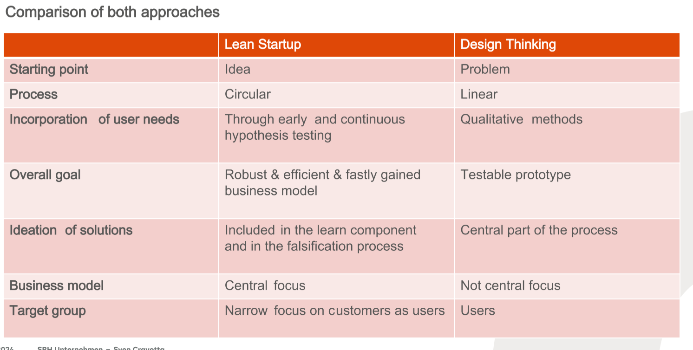
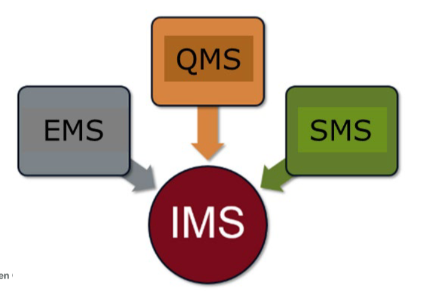

# Quality Management  

# 一

## what is quality?   
Quality refers to how good something is compared to other similar things. In other words, its degree of excellence.

The nature of goods and services describes this term. Quality products have no defects, damages or errors and thus do not lead to complaints.

DIN EN ISO 8402 describes quality as the totality of features of a unit in terms of their suitability to meet specified requirements. This type of quality is standardized by
means of a QMS, so that the quality is secured permanently.

## Which principles are important in quality management?

1.  Customer focus

2.  Leadership

3.  Engagement of people

4.  Process approach

5.  Improvement

6.  Evidence-based decision making

7.  Relationship management

   [相关页面](https://www.paldesk.com/7-core-principles-of-quality-management/#:~:text=What%20are%20the%20Core%20Principles%20of%20Quality%20Management%3F,initiatives%20are%20beneficial%20for%20at%20least%20two%20reasons.)

## How has quality management developed over time?

 [相关页面](https://asq.org/quality-resources/history-of-quality)

1. Quality Management in Medieval Guilds

2. Quality Management in the Industrial Revolution

3. Quality Management in WWII

4. Quality Management in the 20th Century
5. The Development of Total Quality Management

6. Beyond Total Quality Management    

## What criticism is there for the traditional approach of management?

？

## What are the tangible and intangible benefits in improving quality?

Tangible benefit ：

1. Perhaps the most obvious tangible benefit of quality improvement is the reduction of costs associated with non-quality.

2. By translating quality issues into financial measures it  facilitates senior management commitment to improvement activities and,  if sufficiently detailed, suggests priority areas for improvement.   

3. It provides a clear indication of the scale of the opportunity  presented by current poor quality performance and a guide as to the  level of resources which can be committed. 

4. Provides an effective measure of improvement if re-calculated after the improvement has been made.

[相关页面](https://www.wisdomjobs.com/e-university/quality-management-tutorial-363/tangible-benefits-12230.html)

intangible benefits：

1. Increased Customer Satisfaction
2.  Increased Workforce Satisfaction and Motivation
3. Improved Environmental Impact

[相关页面](https://www.wisdomjobs.com/e-university/quality-management-tutorial-363/intangible-benefits-12231.html)

## Which three main contributions to quality management and quality improvement describes DEMING?

1. Create constancy of purpose for improvement of product and service.

2. Adopt the new philosophy

3. Cease dependence on inspection to achieve quality.

4. End the practice of awarding business based on price tag alone.  Instead, minimize total cost by working with a single supplier.

5. Improve constantly and forever every process for planning, production, and service.

6. Institute on the job training.

7. Adopt and institute leadership

8. Drive out fear

9. Break down barriers between staff areas

10. Eliminate slogans, exhortations, and targets for the workforce

11. Eliminate numerical quotas for the workforce and numerical goals for management
12. Remove barriers that rob people of workmanship. Eliminate the annual rating or merit system.

13. Institute a vigorous program of education and self-improvement for everyone

14. Put everyone in the company to work to accomplish the transformation.

## Why do we need Standards?

Standards are needed to assure safety of products, to ensure that products and  materials are tailored-made for their purpose, promote the  interoperability of products and services, facilitate trade by removing  trade barriers, promote common understanding of a product.

## What does a certification according to ISO 9000 represents?

The main purpose of the ISO 9000 standard is to provide a time-tested  framework to help companies establish and follow a systematic approach  for managing organizational processes for rendering consistent quality.

## How it looks the quality process according to ISO 9000? 

？

## What are the myths of Customer and Quality? Describe it

1. Understand the needs  of existing and future customers
2. Align organizational  objectives with customer needs and expectations
3. Meet customer  requirements
4. Measure [customer  satisfaction](https://asq.org/quality-resources/customer-satisfaction)
5. Manage customer  relationships
6. Aim to exceed  customer expectations
7. Learn more about the [customer  experience](https://asq.org/quality-resources/customer-experience) and customer  satisfaction

# 二

## What is the definition of quality planning?

“Quality planning,” as used here, is a structured process for developing products (both goods and services) that ensures that customer needs are met by the final result.

## What is the quality planning problem? 

1. The first component of the quality gap is the understanding gap, that is, lack of understanding of what the customer needs.

2. The second constituent of the quality gap is a design gap. 
3. The third gap is the process gap.
4. The fourth gap is the operations gap.

## What are the quality planning process?

In this step of the quality planning process, we will focus on the role of quality in product development and how that role combines with the technical aspects of development and design appropriate for a particular industry. Within product development, product design is a creative process based largely on technological or
functional expertise.

## Describe each process with three aspects .

**Identify Controls Needed**

​	Evaluate the actual performance of the process.
​	Compare actual performance with the goals.
 	Take action on the difference.

**Design Feedback Loop**

​	Setting the standards for control—i.e., the levels at which the process is out of control and the tools, such as control charts, 	that will be used to make the determination

​	Deciding what action is needed when those standards are not met, e.g., troubleshooting.

​	Designating who will take those actions

**Optimize Self-Control and Self-Inspection**

​	Workers know what they are doing. Their output is measured, and they receive immediate feedback on their performance.
​	Workers have the ability and the means to regulate the outcomes of the process. They need a capa-ble process along with the tools, training, and authority to regulate it.

**Audit Plan for the Transfer**

​	Goals to meet  How meeting the goals will be measured
​	The time phasing for goals, measurement, and analysis  Who will audit
​	What reports will be generated
​	Who will have responsibility for corrective action for failure to meet specific goals

**Implement Plan and Validate Transfer**

# 三

# Describe following tools and techniques

**Cost-Benefit Analysis**

 The cost-benefit analysis is similar to a cost-benefit ratio. The costs and benefits are measured to analyze the
trade-offs of providing quality.

**Cost of Quality**

Cost of quality (COQ) includes all the costs that conform to the required quality of the project, including the cost to ensure conformance to requirements as well as the cost of nonconformance, and finding the right balance. Modern quality management philosophy emphasizes preventing mistakes rather than detecting them later
because the cost of nonconformance is very high.

# Describe following tools and techniques

**Cause and Effect Diagrams** P59

Cause-and-effect diagrams, or Ishikawa diagrams, were developed by Kaoru Ishikawa to illustrate and help determine how various factors relate to potential problems. Cause-and-effect diagrams are also called fishbone diagrams because they resemble the skeleton of a fish. The head of the fish is the effect and each bone of the fish is a cause that leads to that effect. The bones can branch off into smaller bones as you determine the lowerlevel cause-effect relationships. When all the bones are filled in, the diagram lets you look at all the possible causes (individual or combinations) of the effect (or problem) so that you can develop a solution to mitigate that effect. The diagram allows organized thought and encourages orderly consideration of the factors that result in a
certain outcome.

**Flowcharts** P60

Flowcharts show the logical steps in a process and how various elements within a system are related. They can be used to determine and analyze potential problems in quality planning and quality control.
The system, or process, flowchart is probably the one that people are most familiar with. This type of flowchart outlines the logical steps to complete a process. By documenting these logical steps, the team can identify where quality problems might occur and then develop approaches to proactively manage them. Flowcharting also helps
create a process that is repeatable.

**Pareto Diagrams** P61

A Pareto chart or diagram, is a specific type of histogram that is based on Pareto’s principle, which states that a large number of defects or problems are caused by a small number of causes. Pareto’s principle, frequently referred to as the 80/20 rule or 80/20 principle. Which means that eighty percent of the cost of defects are
caused by twenty percent of the problems.

**Histograms** p61

A histogram is a vertical bar graph that represents the frequency of each measured category (known as bins) of variable. In other words, the graph represents a rough frequency distribution of the data. The histogram is particularly useful for identifying common causes. The histogram can be ordered, similar to a Pareto chart, or
unordered.

# Describe following tools and techniques

**Network Diagrams**

The network diagram is a schematic display of the logical relationships, or interdependencies, of all the project activities. You can create it manually or with a project management software tool. The network diagram is a
good tool to show the workflow of the project and it can help effectively plan and organize the project.

**Quality Audit**

One of the most important sub processes performed during the quality assurance process is the quality audit. According to the PMBOK Guide, the quality audit is an independent review conducted by internal or external auditors. The quality audit can be performed on a regularly scheduled basis or an ad hoc basis. The audit is a structured review of quality management activities to identify good or best practices and lessons learned for use
on current or future projects.

# 四

两个例子

# PPT

# Business Models with Lean StartUp Approach and Design Thinking

• Digitalisation raises lots of different business ideas and opportunities. • Successful making use of digitalisation involves therefore to filter out those ideas that allow for exploiting the emerging business opportunities.
• Lean Startup Approach and Design Thinking Approach are two different ways that allow for filtering efficiently and effectively and to build a business model.
• Both approaches have strengths and weaknesses – which one is applied depends on the
situation (e.g. whether a founder is visionary or a problem-solver etc.).

# Integrated Management Systems

## What is an Integrated Management System (IMS)?

### What is an Integrated Management System (IMS)?

The introduction of an Integrated Management System (IMS) follows this management process: analysis, planning, realization and control. This means that the framework conditions must be analyzed for the introduction of an IMS,
the steps for its introduction planned, and then implemented and controlled.

### What are the objectives of an IMS?

1. Increase the efficiency of company processes 

2. Establishment of a flexible management system 

3. Cost and time savings (Double processes should be detoxified)

4. Minimizing product liability risk

### What distinguishes an IMS?

The term "Integrated Management Systems" refers to the close interaction of the individual MS.
Integrative MS connect different MS with each other

### How can an IMS be described?

The IMS describes the process-oriented structure of a company. It incorporates the quality standard, the environmental management standard and occupational safety into the company processes.
The process-oriented structure is divided into leadership, core and supporting processes in the IMS Handbook.
Leadership and management processes are processes that ensure the company's goal.

### What does an IMS look like for industrial companies?

1. Supply chain processes 

2. Production/ Manufacturing processes 

3. Distribution processes 

4. Sales processes

   etc.

### Which legal requirements have to be observed?

1. Quality (ISO 9001); Environment  (ISO 14001); 

2. Occupational Health & Safety (ISO 45001 & BS 8800); 

3. Food Safety & Hazard Analysis Critical Control Points (HACCP);  

4. Ethical Trading Practices (SA 8000); Social & Ethical Accounting,  Auditing and Reporting (AA 1000); 

5. Investor in People (IIP); Law Society  Practice Management Standard (LEXCEL), European Directives and CE  Markings;

6. Information Security (BS 7799); 

7. Quality System Requirements  for Automotive Industry Suppliers (ISO/TS 16949 & QS 9000); 

8. Quality  System Requirements for Telecommunications Industry Suppliers (TL 9000); 

9. and Business Excellence Model (BEM). 

# Quality Management System

## What would be possible quality goals?

1. Optimize Sales
2. Developing new products or services
3. Improving communication between the departments in the company
4. Improving customer satisfaction

## Derive two activities to achieve the following quality goals.

Goal 1: Optimize Sales 

​	Consider customer needs

​	Offer special functions and features 

​	Improve after sales services to target groups 

​	Implement Customer relationship Management
Goal 2: Developing new products or services 

​	Market Analysis / SWOT Analysis  Conducting market research (questionnaire to your customer to find out their wishes and 		needs)
​	Product and market test

Goal 3: 

​	Improving communication between the departments in the company 

​	Reporting system / Intranet (Introduction of an information system, for example, inhouse wiki, knowledge management)
​	Constant information and communication about all changes 

​	Involvement of staff in the decision-making process
Goal 4: 

​	Improving customer satisfaction 

​	Complaint management: recording the complaints of the customers 

​	Determination of countermeasures (for example, better consulting services, more information and communication, 	involvement of customers in the service process, avoiding quality fluctuations, increasing services, etc.) Transparency

Goal 5: 

Increasing employee satisfaction 

Creating a common thinking and a strong culture 

Introduction of the business suggestion 

Create bonus systems for good performance 

Transparent business decisions and goals

Offer personnel development measures

## Clarify this with the example of increased customer complaints

?

# Safety Management System

