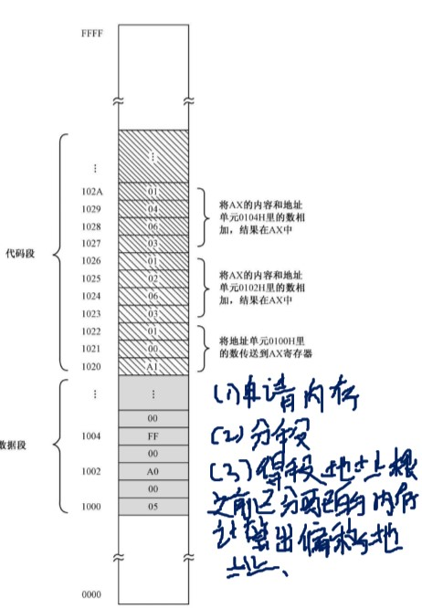

# 8086处理器的内存分段机制
> x86汇编语言 从实模式到保护模式
## 程序的重定位问题
在我们的实际使用中申请到的内存往往都是随机的，但是如果我们这时在程序中使用了绝对的内存地址，那程序的运行一定会崩溃。可以看到准确的重定位程序至关重要，这里我们借助8086的内存分段机制。
### 几个概念：
1. 段寄存器：描述内存分段时，保存段的信息。 
2. 物理地址：对应内存条上的实际地址。
3. 偏移地址： 段内存储单元相对于短地址的距离。
4. 段地址： 段的起始地址（对应着一个物理地址）。
5. 逻辑地址： 短地址+偏移地址。
6. 8086 内部有4 个段寄存器。其中，CS 是代码段寄存器，DS 是数据 段寄存器，ES 是附加段（Extra Segment）寄存器,IP 指令指针寄存器。
### 内存分配机制：

我们把一个程序分为数据段与代码段，在数据段寄存器（DS）中存储数据段的段地址，代码段中存储代码段的段地址。   
物理地址 = 段地址+偏移地址  
[1]当处理器访问内存时，它把指令中指定的 内存地址看成是段内的偏移地址，而不是物理地址。这样，一旦处理器 遇到一条访问内存的指令，它将把DS 中的数据段起始地址和指令中提供的段内偏移相加，来得到访问内存所需要的物理地址。

当一段代码开始执行时， CS 指向代码段的起始地址，IP 则指向段内偏移。这样，由CS 和IP 共同 形成逻辑地址，并由总线接口部件变换成物理地址来取得指令。然后， 处理器会自动根据当前指令的长度来改变IP 的值，使它指向下一条指
令。

8086的处理器地址引线：20根，那么逻辑地址就是20位。而我们的寄存器只有16位，为了解决这个问题：段地址实际上也是20位，将段寄存器中的值左移4位（每个分段必须加载到地址最低位为0的位置，相对于16进制表示而言）。偏移地址仍然是16位，也就意味着每个段的最大长度为65536个字节。

8086 处理器的逻辑分段，起始地址都是16 的倍数，这称为是 按16 字节对齐的。

同样在不允许段之间重叠的情况下，每个段的最大长度是64KB，因 为偏移地址也是16 位的，从0000H 到FFFFH。在这种情况下，1MB 的 内存，最多只能划分成16 个段，每段长64KB，段地址分别是0000H、
1000H、2000H、3000H，…，一直到F000H。
  
[我的博客](https://songzihui-sudo.github.io/)
## 引用
[1] x86汇编语言 从实模式到保护模式
